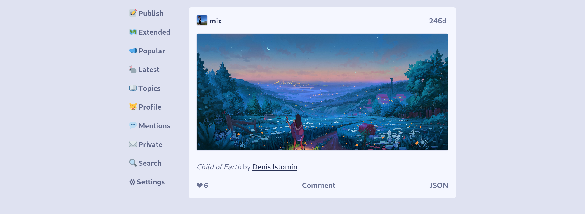

# Oasis

Oasis is a **free, open-source, peer-to-peer social application** that helps
you follow friends and discover new ones on [Secure Scuttlebutt (SSB)][ssb].

**🦀 Powered by SSB.**  
You're the center of your own distributed network. Online or offline, SSB works
anywhere that you are. Follow the people you want to see and never worry about
spam again. Migrate your data to another SSB app any time you want.

**🌐 Bring your own browser.**  
Use your favorite web browser to read and write messages to the people you care
about. Oasis runs over HTTP, so you don't need to worry about adding another
Electron app to your computer.

**🏰 Just HTML and CSS.**  
No browser JavaScript! Oasis has strict security rules that prevent any
JavaScript from running in your browser, which helps us make Oasis accessible
and easy to improve.



## Usage

Start Oasis from a command-line interface with the `oasis` command.

```console
$ oasis --help
Usage: oasis [options]

Options:
  --version   Show version number                                      [boolean]
  -h, --help  Show help                                                [boolean]
  --open      Automatically open app in web browser. Use --no-open to disable.
                                                       [boolean] [default: true]
  --offline   Don't try to connect to scuttlebutt peers or pubs. This can be
              changed on the 'settings' page while Oasis is running.
                                                      [boolean] [default: false]
  --host      Hostname for web app to listen on  [string] [default: "localhost"]
  --port      Port for web app to listen on             [number] [default: 3000]
  --debug     Use verbose output for debugging        [boolean] [default: false]
```

## Installation

Most people should install stable releases with [npm](https://npmjs.org/).
Please make sure that your Node.js version is the [**current** or **active LTS** release](https://nodejs.org/en/about/releases/).

```shell
npm --global install @fraction/oasis@latest
```

For faster updates and less stability, install from GitHub and upgrade often.

```shell
npm --global install github:fraction/oasis
```

Want more? Check out [`install.md`](https://github.com/fraction/oasis/blob/master/docs/install.md).

## Resources

- [Contributing](https://github.com/fraction/oasis/blob/master/docs/contributing.md)
- [Architecture](https://github.com/fraction/oasis/blob/master/docs/architecture.md)
- [Help](https://github.com/fraction/oasis/issues/new)
- [Roadmap](https://github.com/fraction/oasis/blob/master/docs/roadmap.md)
- [Security Policy](https://github.com/fraction/oasis/blob/master/docs/security.md)
- [Source Code](https://github.com/fraction/oasis.git)

## See Also

- [Patchbay](https://github.com/ssbc/patchbay)
- [Patchwork](https://github.com/ssbc/patchwork)
- [SSB-Browser](https://github.com/arj03/ssb-browser-demo)
- [SSB-Server](https://github.com/ssbc/ssb-server)
- [Yap](https://github.com/dominictarr/yap)

## License

AGPL-3.0

[ssb]: https://en.wikipedia.org/wiki/Secure_Scuttlebutt
