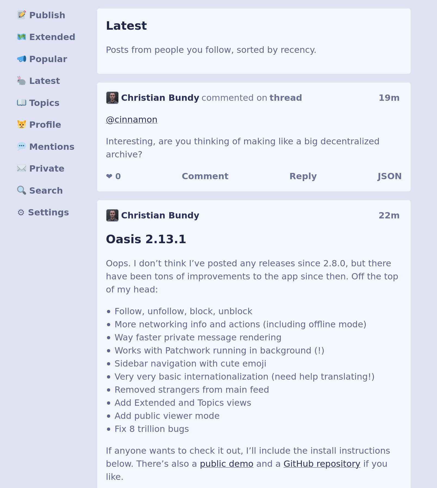

# Oasis

**Friendly Scuttlebutt interface designed for simplicity and accessibility.**
This is an experimental client built with HTML, CSS, and Node.js without any
front-end JavaScript. The goal is to support basic social messaging schemas with
some extra tools for debugging, _not_ to support all known message types.



## Usage

```console
$ oasis --help
Usage: oasis [options]

Options:
  --version   Show version number                                      [boolean]
  -h, --help  Show help                                                [boolean]
  --open      Automatically open app in web browser. Use --no-open to disable.
                                                       [boolean] [default: true]
  --offline   Don't try to connect to scuttlebutt peers or pubs. This can be
              changed on the 'meta' page while Oasis is running.
                                                      [boolean] [default: false]
  --host      Hostname for web app to listen on  [string] [default: "localhost"]
  --port      Port for web app to listen on             [number] [default: 3000]
  --debug     Use verbose output for debugging        [boolean] [default: false]
```

## Installation

Most people should install stable releases with [npm](https://npmjs.org/).

```shell
npm --global install @fraction/oasis@latest
```

Please make sure that your Node.js version is the [**current** or **active LTS** release](https://nodejs.org/en/about/releases/).

For faster updates and less stability, install from GitHub and upgrade often.

```shell
npm --global install github:fraction/oasis
```

Want more? Check out [`install.md`](https://github.com/fraction/oasis/blob/master/docs/install.md).

## Resources

- [Contributing](https://github.com/fraction/oasis/blob/master/docs/contributing.md)
- [Architecture](https://github.com/fraction/oasis/blob/master/docs/architecture.md)
- [Help](https://github.com/fraction/oasis/issues/new)
- [Roadmap](https://github.com/fraction/oasis/blob/master/docs/roadmap.md)
- [Security Policy](https://github.com/fraction/oasis/blob/master/docs/security.md)
- [Source Code](https://github.com/fraction/oasis.git)

## See Also

- [patchbay](https://github.com/ssbc/patchbay)
- [patchwork](https://github.com/ssbc/patchwork)
- [ssb-browser-demo](https://github.com/arj03/ssb-browser-demo)
- [ssb-server](https://github.com/ssbc/ssb-server)
- [yap](https://github.com/dominictarr/yap)

## License

AGPL-3.0
